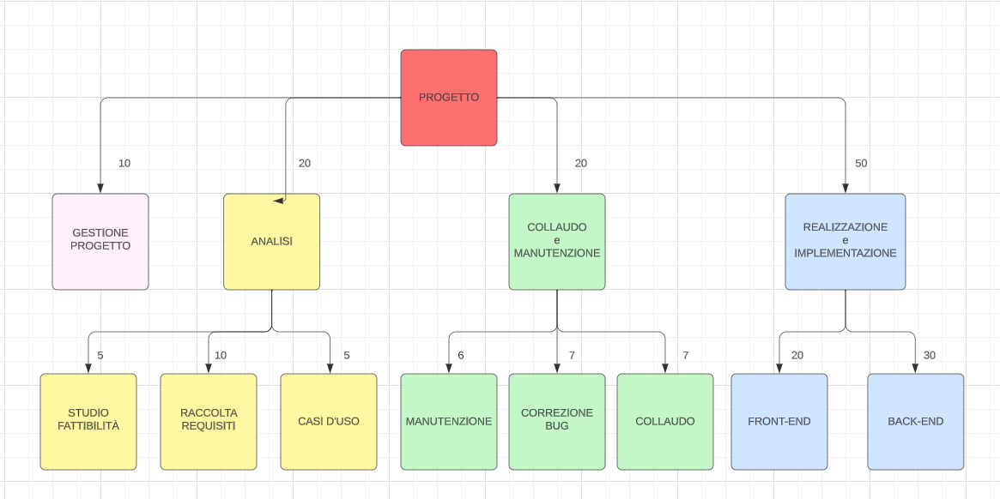

- Possibilità di scambiare i biglietti (vendere - comprare) per eventi con utenti impossibilitati ad andarci - (utente)
- Visualizzare eventi e cercarli per categoria - (utente)
- Visualizzare eventi passati a cui si ha partecipato - (utente)
- Account e Login - (sistema)
- Personalizzazione Account - (utente)
- Visualizzazione Date, Orari e Luogo (mappa) eventi - (utente)
- Tipologia di eventi preferita preferiti - (utente - sistema)
- Eventi di cui si è in possesso del biglietto sono segnati nel calendario - (utente)

Requisiti:
- connessione a internet
- carta di credito

,[Logged%20Customer]-(Show%20past%20Event%20where%20Customer%20participated),[Customer]-(Sign%20In),(Sign%20In)%3E(Add%20Card),(Sign%20In)%3E(Verify%20Email),(Sign%20In)%3C(Favourite%20Type%20of%20Event),(Login)%3C(Reset%20Password),[Logged%20Customer]-(Buy%20Ticket),[Logged%20Customer]-(Logout),[Logged%20Customer]-(Change%20Personal%20Information),[Logged%20Customer]-(Research%20Ticket),[Logged%20Customer]-(View%20Ticket),[Logged%20Customer]-(Sell%20Ticket),(Buy%20Ticket)%3C(Add%20Event%20to%20the%20Calendar),(Logout)%3C(Delete%20Account),[Customer]%5E[Logged%20Customer],(Buy%20Ticket)%3E[Bank])

Scambio di Biglietti in modo Sicuro ed Economico

Scambio di Biglietti sicuro e con un prezzo di rivendita inferiore a quello del primo acquisto
